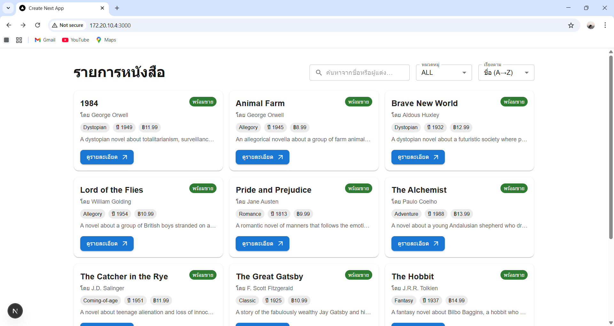
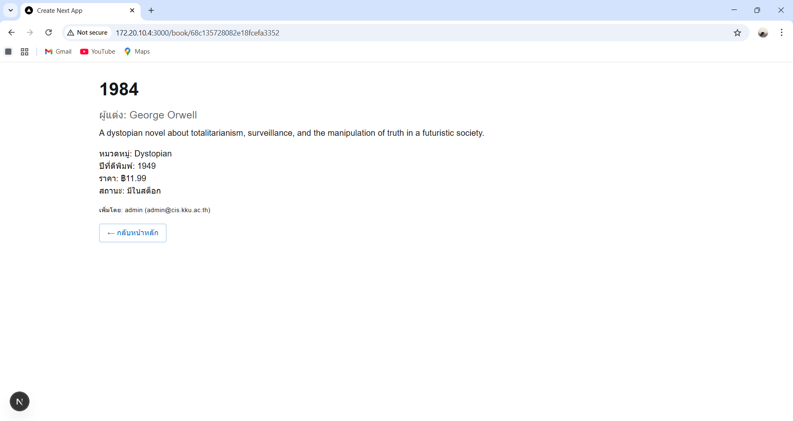

# 📚 Book App

แอปพลิเคชันเว็บสำหรับแสดง **รายการหนังสือ** และ **รายละเอียดหนังสือแต่ละเล่ม**  
สร้างขึ้นเพื่อฝึกพัฒนาเว็บด้วย **Next.js (App Router)**, **TypeScript**, และ **Material UI (MUI)**

---

## 🖼️ ตัวอย่างหน้าจอ
  

---

## 👩‍💻 ผู้เขียน
**นางสาวภวพิชญา คำวงษา**  
**รหัสนักศึกษา: 663450042-8**  
นักศึกษาชั้นปีที่ 3 สาขา **วิทยาการคอมพิวเตอร์และสารสนเทศ**  
คณะ **สหวิทยาการคอมพิวเตอร์ มหาวิทยาลัยขอนแก่น**

[🔗 GitHub Repository](https://github.com/pwpitchaya/bookapi)
